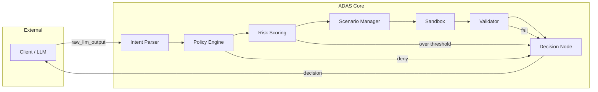

# ADAS – Autonomous Deterministic Agent System

> **Tagline:** Safe, Resilient, Multi-Scenario AI Agent Execution Engine

---

## Overview

**ADAS** connects LLM outputs to safe execution with policy, risk, sandbox, and validation layers. The system is **deterministic** at the decision point: commit / reject / escalate is driven by rules and risk scores, not by raw LLM output alone. Full **traceability** and **audit** support compliance.

---

## Architecture

```
┌─────────────────────────────────────────────────────────────────────────────┐
│                           ADAS Pipeline (LangGraph)                          │
├─────────────────────────────────────────────────────────────────────────────┤
│  raw_llm_output → Intent Parser → Policy → Risk → Scenario → Sandbox →      │
│                   Validator → Decision → (commit | reject | escalate)       │
└─────────────────────────────────────────────────────────────────────────────┘
```



| Component         | Role |
|------------------|------|
| **Intent Parser** | Converts LLM output to structured JSON actions |
| **Policy Engine** | Role & scenario-based allow/deny |
| **Risk Scoring**  | Quantitative risk score, thresholds, escalation |
| **Scenario Manager** | Scenario switching from risk signals |
| **Sandbox**       | Dry-run / mock execution, rollback |
| **Validator**     | Consistency, hallucination detection |
| **Decision Node** | commit / reject / escalate |
| **Logging & Metrics** | JSON logs, metrics, dashboard |

---

## Quick Start

```bash
# Dependencies
pip install -r requirements.txt

# Run API
uvicorn app.api.main:app --reload

# Optional: run dashboard (API must be running)
streamlit run dashboard/app.py
```

- **API:** http://localhost:8000  
- **Docs (OpenAPI):** http://localhost:8000/docs  
- **Dashboard:** http://localhost:8501 (after `streamlit run dashboard/app.py`)

---

## Docker

```bash
# Build and run API + Dashboard
docker compose up --build

# API: http://localhost:8000  |  Dashboard: http://localhost:8501
```

- **Image:** Multi-stage `Dockerfile`, non-root user, healthcheck. Runtime deps only (`requirements-docker.txt`).
- **Compose:** `api` (uvicorn) + `dashboard` (Streamlit). Dashboard uses `ADAS_API_URL=http://api:8000` to reach the API.
- **Faster rebuilds:** Build with BuildKit so pip cache is reused: `DOCKER_BUILDKIT=1 docker compose build`.

---

## Testing

```bash
# All tests
pytest

# With coverage report
pytest --cov=app --cov-report=term-missing

# Exclude slow stress tests
pytest -m "not slow"
```

- **Unit tests:** per node (intent_parser, policy, risk, sandbox, validator, execution_controller, scenario_manager, graph, logging).
- **Integration tests:** API endpoints (`/v1/parse`, `/v1/run`, `/v1/metrics`, etc.).
- **Adversarial tests:** prompt injection, forbidden params, oversized input.
- **Stress:** `tests/test_stress.py` (marker `slow`).

---

## API Summary

| Method | Endpoint | Description |
|--------|----------|-------------|
| GET | `/health` | Health check |
| POST | `/v1/parse` | Parse raw LLM output → intent |
| POST | `/v1/policy/check` | Policy allow/deny |
| POST | `/v1/risk/score` | Risk score for intent + scenario |
| POST | `/v1/sandbox/run` | Run intent in sandbox (dry-run) |
| POST | `/v1/validate` | Validate intent + sandbox result |
| POST | `/v1/decide` | Decision from all results |
| POST | `/v1/run` | **Full pipeline** (Intent → … → Decision) |
| GET | `/v1/metrics` | Metrics for dashboard |

See **OpenAPI** at `/docs` and **docs/API.md** for request/response contracts.

---

## Project Structure

```
ADAS/
├── app/
│   ├── api/           # FastAPI app & endpoints
│   ├── core/          # Nodes: intent_parser, policy_engine, risk_engine,
│   │                  #       scenario_manager, sandbox, validator,
│   │                  #       execution_controller, graph
│   ├── models/        # Pydantic schemas
│   ├── config/        # Policy & risk config
│   ├── tools/         # Mock systems, scenario data
│   └── logging/       # Structured logs, metrics, audit
├── dashboard/         # Streamlit monitoring app
├── tests/             # Unit, integration, adversarial, stress
├── docs/              # Architecture, phases, API
├── Dockerfile        # Multi-stage API image (slim, non-root)
├── docker-compose.yml # API + Dashboard
├── requirements-docker.txt  # Runtime deps only for image
├── pytest.ini
├── requirements.txt
└── README.md
```

---

## Phases & Docs

| Phase | Doc | Status |
|-------|-----|--------|
| 1 – Setup & Input | `docs/02_PHASE_01_*.md` | Done |
| 2 – Policy Engine | `docs/03_PHASE_02_*.md` | Done |
| 3 – Risk Scoring | `docs/04_PHASE_03_*.md` | Done |
| 4 – Sandbox & Validator | `docs/05_PHASE_04_*.md` | Done |
| 5 – Execution Controller | `docs/06_PHASE_05_*.md` | Done |
| 6 – LangGraph | `docs/07_PHASE_06_*.md` | Done |
| 7 – Logging & Monitoring | `docs/08_PHASE_07_*.md` | Done |
| 8 – Testing & Documentation | `docs/09_PHASE_08_*.md` | Done |

Full index: **docs/00_INDEX.md**. Architecture: **docs/01_ARCHITECTURE_OVERVIEW.md**.

---

## Security & Compliance

- **No blind trust in LLM:** All output is parsed, validated, and gated by policy and risk.
- **Forbidden params:** `exec`, `eval`, `shell`, `password`, `api_key`, etc. are blocked by policy.
- **Structured JSON logging** and **metrics** support audit and monitoring (set `ADAS_JSON_LOGS=1` for JSON logs).

---

## License

Educational / portfolio use. Adjust license as needed.
