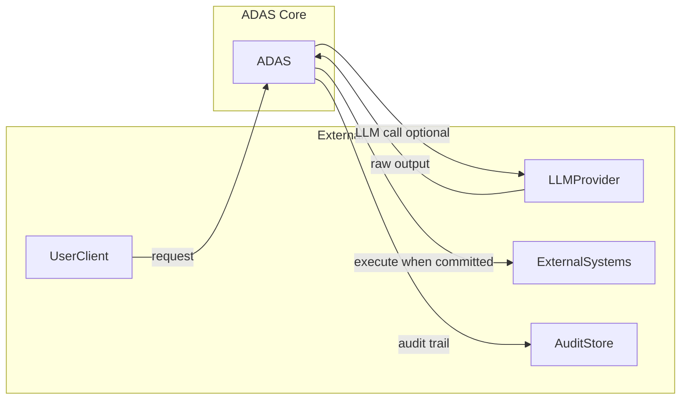
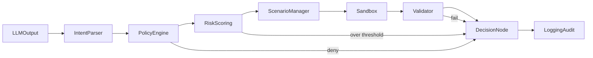
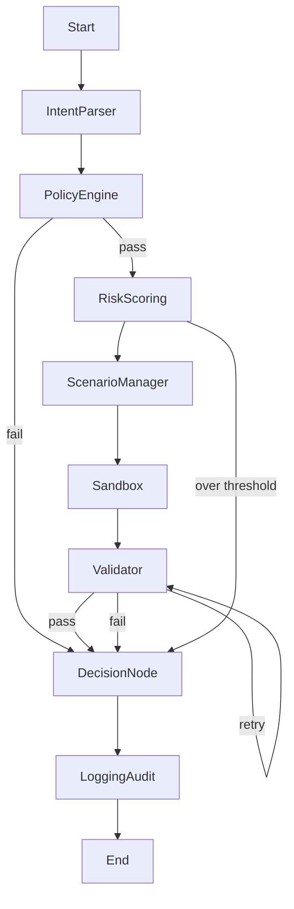

# ADAS – Architecture Overview

**Autonomous Deterministic Agent System**  
*Tagline: Safe, Resilient, Multi-Scenario AI Agent Execution Engine*

النظام في سطر واحد: **مخرجات LLM → structured actions → policy/risk/sandbox/validator → commit أو reject أو escalate، مع full audit و traceability.**

---

## 1. System Context (نطاق النظام والحدود)

الطلب يدخل إلى ADAS عبر **API** (مثلاً FastAPI): العميل يرسل إما نصًا خامًا من واجهة المستخدم أو مخرجات LLM جاهزة. ADAS لا يستدعي الـ LLM داخليًا بالضرورة؛ يمكن أن يكون الـ LLM خارجيًا (مثلاً من تطبيق آخر أو queue). ما يهم هو أن **المدخل هو نص أو بنية تعبّر عن intent**، والنظام يحولها إلى إجراءات منظمة ويمررها عبر طبقات الحوكمة والتنفيذ.

**داخل النطاق (ADAS core):** Intent Parser، Policy Engine، Risk Scoring، Scenario Manager، Sandbox، Validator، Decision Node، Logging & Audit، وتنسيق LangGraph.

**خارج النطاق:** مزود الـ LLM (OpenAI/Claude/OpenRouter)، الأنظمة الخارجية التي قد يُنفَّذ عليها الإجراء لاحقًا (trading، CRM، إلخ)، المستخدم النهائي أو العميل، ومخزن السجلات النهائي (Audit Store) إذا كان منفصلاً.

---

## 2. Design Principles (مبادئ التصميم)

| المبدأ | الوصف |
|--------|--------|
| **Determinism** | القرار النهائي (commit/reject/escalate) يعتمد على state + rules + risk score، وليس على non-deterministic LLM output وحده. الـ LLM ينتج intent فقط؛ باقي الـ pipeline ثابت وقابل للتكرار. |
| **Safety by layers** | لا ثقة كاملة بأي طبقة واحدة. Policy + Risk + Sandbox + Validator + Decision كلها حواجز؛ أي فشل في طبقة يمنع الوصول للتنفيذ النهائي غير المراقب. |
| **Traceability** | كل خطوة لها structured log مع correlation_id؛ إمكانية إعادة بناء أي run بالكامل للتدقيق والتحليل. |
| **Multi-scenario** | السلوك يعتمد على scenario (مثلاً normal، high_volatility، maintenance) عبر Scenario Manager؛ قواعد وحدود مختلفة لكل سيناريو. |
| **Resilience** | فشل node → retry محدود ثم escalate أو reject؛ لا تنفيذ صامت ولا تجاهل للأخطاء. |

---

## 3. High-Level Architecture (الطبقات والمكونات)

### 3.1 تقسيم منطقي

- **Ingestion & Normalization:** Intent Parser — تحويل مخرجات LLM إلى structured actions قابلة للمعالجة.
- **Governance:** Policy Engine، Risk Scoring، Scenario Manager — من يسمح، ما الحدود، أي مسار (scenario).
- **Execution & Verification:** Sandbox (dry-run)، Validator (consistency، hallucination)، ثم Decision Node (commit/reject/escalate).
- **Observability:** Logging & Audit — يعمل عبر كل الـ pipeline ويسجل كل خطوة ونتيجة.

### 3.2 Core Nodes (جدول موسّع)

| المكون | المسؤولية | المدخلات النموذجية | المخرجات النموذجية | الملف |
|--------|-----------|---------------------|---------------------|-------|
| **Intent Parser** | تحويل مخرجات LLM إلى JSON structured actions | raw string (LLM output) | ParsedIntent أو IntentParseError | `app/core/intent_parser.py` |
| **Policy Engine** | التحقق من الصلاحيات والقواعد (role، scenario، limits) | ParsedIntent، role، scenario | PolicyAllow / PolicyDeny + reason | `app/core/policy_engine.py` |
| **Risk Scoring** | حساب المخاطر والانحرافات والتأثير | action، scenario context | risk_score، threshold_breach، signals | `app/core/risk_engine.py` |
| **Scenario Manager** | تحديد السيناريو واختيار المسار والقواعد الديناميكية | context، market/ops signals | scenario_id، path config | `app/core/scenario_manager.py` |
| **Execution Sandbox** | تنفيذ محاكى قبل الحقيقي، مع rollback | validated action | SandboxResult (dry_run output أو failure) | `app/core/sandbox.py` |
| **Validator** | consistency، integrity، hallucination-free | intent + sandbox result | ValidationPass / ValidationFail + checks | `app/core/validator.py` |
| **Decision Node** | commit / reject / escalate بناءً على كل النتائج | policy، risk، validation، sandbox | decision + reason | `app/core/execution_controller.py` |
| **Logging & Audit** | تسجيل كل خطوة ونتائج المراجعة والأداء | كل state ونتائج الـ nodes | structured logs، audit trail | `app/logging/` |
| **LangGraph** | ربط الـ nodes في graph مع branching و loops و retry | state object | state updates، routing | graph definition في `app/core/` |

---

## 4. Data & Control Flow (تدفق البيانات والتحكم)

### 4.1 High-Level Flow (Mermaid)

المسار السليم: من المدخل حتى Logging. فشل في Policy أو Risk يوجّه إلى رفض أو escalate؛ فشل في Validator قد يفعّل retry ثم reject.

### 4.2 State Object (ما يمر بين الـ nodes)

| الحقل | الوصف |
|-------|--------|
| `raw_llm_output` | النص الخام من الـ LLM |
| `parsed_intent` | نتيجة Intent Parser (أو خطأ) |
| `policy_result` | allow/deny + reason |
| `risk_score` | رقم + threshold_breach |
| `scenario_id` | السيناريو المختار |
| `sandbox_result` | نتيجة التنفيذ المحاكى |
| `validation_result` | pass/fail + تفاصيل الفحوصات |
| `decision` | commit / reject / escalate + reason |

---

## 5. Node Contracts (عقود الـ Nodes) — ملخص

| Node | Input | Output (ناجح / فاشل) |
|------|--------|----------------------|
| **Intent Parser** | raw string (LLM) | `ParsedIntent` \| `IntentParseError` |
| **Policy Engine** | ParsedIntent + context (role، scenario) | `PolicyAllow` \| `PolicyDeny` + reason |
| **Risk Scoring** | action + scenario context | `risk_score`, `threshold_breach`, optional `signals` |
| **Scenario Manager** | context، signals | `scenario_id`, path/config |
| **Sandbox** | validated action (بعد policy/risk) | `SandboxResult` (success/dry_run_output أو failure) |
| **Validator** | intent + sandbox result | `ValidationPass` \| `ValidationFail` + checks |
| **Decision Node** | كل النتائج السابقة | `commit` \| `reject` \| `escalate` + reason |

للتفاصيل الكاملة لكل node (schemas، حقول، أخطاء) راجع ملفات المراحل في `docs/02_PHASE_01_...` حتى `docs/09_PHASE_08_...`.

---

## 6. LangGraph Orchestration (نظرة مبدئية)

الـ pipeline يتحول إلى **StateGraph**: كل مكون = node، والحالة المشتركة = state object يمرّ بينهم. التفرعات: بعد Policy → pass أو fail (إلى التالي أو إلى رفض/escalate)؛ بعد Risk → under_threshold أو over_threshold/escalate؛ بعد Validator → retry (loop) أو إلى Decision؛ ثم Decision → LoggingAudit.

---

## 7. Failure Modes & Resilience

| الحالة | السلوك |
|--------|--------|
| فشل parse (Intent Parser) | رفض الطلب أو retry مع إعادة طلب من الـ LLM إن أمكن؛ لا متابعة بدون parsed intent صالح. |
| رفض policy | إيقاف المسار، قرار reject، تسجيل السبب، وإكمال الـ audit. |
| تجاوز risk threshold | لا commit؛ إما reject أو escalate للإنسان/نظام خارجي حسب الإعداد. |
| فشل sandbox | اعتبار التنفيذ فاشلًا؛ لا تمرير للـ Validator بانتظار نجاح، مع retry محدود إن وُجد. |
| فشل validation | retry محدود (مثلاً إعادة التحقق أو إعادة sandbox) ثم reject إذا استمر الفشل. |
| timeout | اعتبار الـ node فاشلًا؛ escalate أو reject؛ عدم commit عند الشك. |

استراتيجيات عامة: **retry محدود** لكل node قابل لذلك، **circuit-breaker** اختياري عند تكرار فشل خدمة خارجية، **escalate** للإنسان أو نظام مراقبة، و**عدم commit أي شيء** عند أي شك في سلامة أو صحة النتيجة.

---

## 8. Security & Safety Model

- **عدم الثقة في مخرجات LLM:** كل output يمر بـ schema validation (Pydantic)، ثم Policy، ثم Validator (consistency، hallucination، وحماية من prompt injection قدر الإمكان). لا تنفيذ بناءً على نص خام فقط.
- **الصلاحيات:** role-based و scenario-based؛ لا تنفيذ حقيقي إلا بعد اجتياز كل الطبقات (Policy، Risk، Sandbox، Validator، Decision).
- **Sandbox:** عزل التنفيذ التجريبي عن الإنتاج؛ لا تأثير فعلي على الأنظمة الحقيقية حتى يصدر Decision = commit من الـ Decision Node.

---

## 9. Observability & Audit

- **Structured logging (JSON):** كل خطوة مع timestamp، node، correlation_id، input_hash أو summary، output status، و latency.
- **مقاييس مقترحة:** latency per node، success/fail rate، risk score distribution، escalation rate. التفاصيل والتنفيذ في Phase 7 (راجع [08_PHASE_07_LOGGING_AND_MONITORING.md](08_PHASE_07_LOGGING_AND_MONITORING.md)).

---

## 10. Technology Stack & Rationale

| المكون | التقنية | المبرر |
|--------|---------|--------|
| Orchestration | LangGraph | Stateful graph مع branching و loops و retry؛ مناسب لـ multi-node agent pipeline. |
| LLM | OpenAI / Claude / OpenRouter | مرونة في اختيار الموديل؛ ADAS يعامل المدخل كنص/بنية بغض النظر عن المصدر. |
| API | Python، FastAPI (async) | أداء جيد، واجهة واضحة، ودعم async للعمليات الطويلة. |
| Validation | Pydantic، JSON schema | schema enforcement و deterministic validation على الحدود بين الـ nodes. |
| Sandbox | محاكاة أولاً، لاحقاً Docker | عزل التنفيذ التجريبي؛ إمكانية الانتقال لـ dockerized sandbox لاحقًا. |
| Logging | Structured JSON، audit trail | Traceability و compliance؛ إمكانية إعادة بناء أي run. |
| Monitoring | Prometheus/Grafana أو Streamlit | مقاييس ولوحة مراقبة؛ التفاصيل في Phase 7. |

---

## 11. Trade-offs & Future Considerations

**Trade-offs:**

- **Determinism في القرار النهائي** على حساب المرونة الكاملة للـ LLM؛ القرار النهائي مقيد بالقواعد والـ risk وليس حرية الـ LLM فقط.
- **طبقات أمان متعددة** تعني latency أعلى؛ مقبول في سياقات تحتاج أمانًا وموثوقية.
- **Sandbox محاكى أولاً** يقلل التعقيد التشغيلي؛ الانتقال لـ dockerized أو بيئة معزولة حقيقية لاحقًا حسب الحاجة.

**مستقبلاً:**

- دعم **multi-agent** وتنسيق عدة agents داخل نفس الـ graph.
- تكامل مع أنظمة حقيقية (trading، CRM، إلخ) مع نفس طبقات الأمان.
- تحسين **risk model** (مزيد إشارات، حدود ديناميكية، تعلم من السجلات).

---

## 12. References & Next Steps

- [00_INDEX.md](00_INDEX.md) — فهرس المراحل وحالة التقدم.
- [PROJECT_STRUCTURE.md](PROJECT_STRUCTURE.md) — هيكلية الريبو وربط الملفات بالمراحل.
- [02_PHASE_01_SETUP_AND_INPUT.md](02_PHASE_01_SETUP_AND_INPUT.md) … [09_PHASE_08_TESTING_AND_DOCUMENTATION.md](09_PHASE_08_TESTING_AND_DOCUMENTATION.md) — تفاصيل تنفيذ كل مرحلة.
